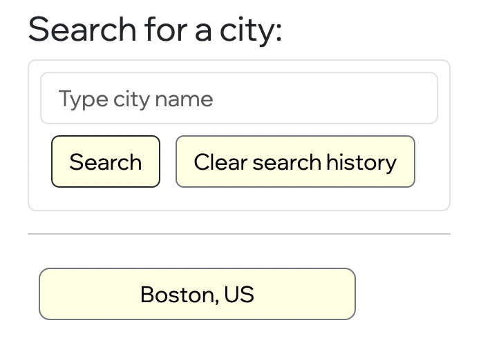
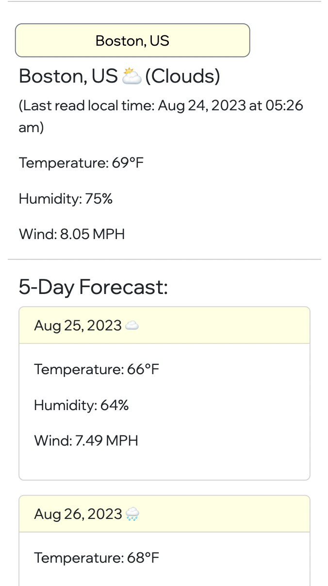

# Weather Dashboard

## Installation
* No installation steps! This application should be accessible the moment you open up the link and relies on local storage with the assistance of a weather API. 

## Usage
* The primary resource is this city search panel. You can enter the name of a city and search for it. The current weather will be displayed, as well as the next 5 days of weather. You can also choose to clear your search history so the search box will not provide previously-searched options. 
*  

* When a city is selected, it should look like the following:
* 

## Credits
* Nick Jeffs
* Columbia Coding Bootcamp

## How to Contribute
* Fork the repository, make your preferred changes, and submit a pull request! I will review as I'm able to. 